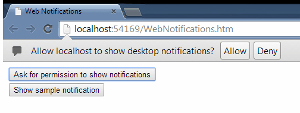
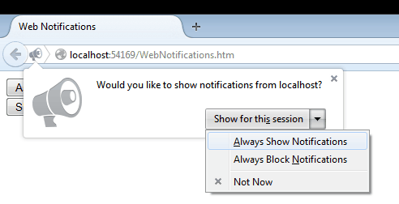
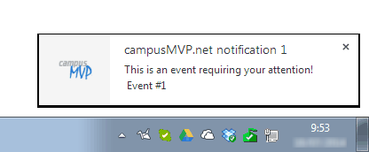
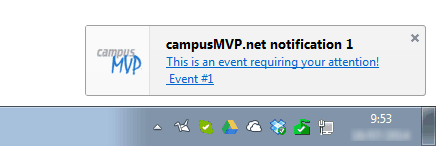

# WebNotificationsWrapper
An AMD-compatible wrapper around the standard W3C Web Notifications API

This repository contains a reusable class that **simplifies the use of the standard Web notifications API in several browsers** (Chrome, Firefox, Opera... not in Internet Explorer or Edge). It allows to show **desktop notifications to users** with custom icons and auto-closing after a specified time. It works in any desktop operating system (Windows, Mac, Linux), but it won't have effect in mobile browsers since they don't support the API.

The minified version of the library is less than 1KB, and a .map file is included for debugging.

##Accessing the exposed functionality

You just need to include the WebNotifications.js or WebNotifications.min.js (minified version) file in your web app.

This library is **AMD-compatible**. That means that you can use any AMD-compliant module loader (like Require.js) to use it as a dependency for module injection, but you can use it directly too just by including the file in a `<script>` tag.

If you use it directly in a page (like it's done in the *WebNotificationsTest.htm* sample file in the repo) you can access all the functionality through the **WebNotifications** global object.

If you load it as a dependency with AMD, just use the parameter name that best suits you.

>**Important**: the Web Notifications functionaity won't work if you serve your app from the file system. When testing this library make sure you're serving your pages from a web server. Any local server will be OK.

##Exposed members

- **areSupported()**: function that returns a boolean indicating if the current browser allows showing desktop notifications (true) or doesn't support this ability (false). You should check this at least once in your module before trying to show any notifications.

```JavaScript
if (WebNotifications.areSupported()){
   ...
}
```

- **permissions** enum: an enumeration exposing three possible values that map to the possible states in permissions to show notifications for the current user in the current browser. The three possible values are:
    - **default**: this is the default permission, which means that your code has never requested permission to show desktop notifications to the user. Normally this means your web app has not been granted permission to show notifications to the user (default value) and that it must ask for this permission in the first place.
    - **denied**: the user has denied your app the ability to show desktop permissions. It you try to show a notification it won't work, so it's not worth trying.
    - **granted**: the user has granted your app the ability to show desktop notifications.

- **currentPermission()**: returns a `permissions` enumeration's value indicating the permission that the current user has to show notifications in the browser. It can take three different values that you can compare using the `permissions` enumeration of the class.

```JavaScript
if (WebNotifications.areSupported()){
	if (WebNotifications.currentPermission() === WebNotifications.permissions.granted) { 
	   //Show notification
	}
}
```

- **askForPermission()**: this method force the browser to ask the current user for permissions to show her any notifications that you want in the future. This is a needed step before being able to use the rest of the functionality. **It's very important that you use this method in the context of a user-generated action**, like clicking a button or a link, or something similar. If you try to use it directly from independent code not resulting of a user's action (like in the load event of the page or in a timer) it won't work. This is a browser-imposed limitation to prevent bad-behaved apps to ask users for permission without their specific consent:

```HTML
<input type="button" value="Ask for permission to show notifications" onclick="WebNotifications.askForPermission();" />
```

Each browser shows a different dialog to ask for this permission:





In Firefox case the user can allow just temporary access to the web notifications functionality.

- **new(title, message, [icon], [tag], [timeout])**: this method allows you to create a new custom desktop notification and get a reference to it in order to handle events or get a good control over it. This method returns a handle to the new notification object, so that you can use it to handle its events or any other purpose. This function parameters are:
    - **title**: a string with the main title for the notification. Mandatory. There's no limit in the length of this string, but you should keep it short or it can be automatically cut by the browser.
    - **message**: a string with the main message of the notification. Mandatory. Usually longer than the title, but can be automatically cut by the browser, so try to keep it short and to the point. You can use '\n' to generate several lines in the body of the notification.
    - **icon**: a string with the relative path to an image in your app's directory with an icon to show alongside the notification. Optional. The recommended size is 60x60 pixels.
    - **tag**: a string with a custom and arbitrary value that serves as a way to classify notifications of the same type. Optional (you can use `null` if you want to use the last parameter). Using this tag you can identify notifications that belong to the same group or use it as a way to distinguish between them in events that use the same handler, for example. You can use it to annotate information about the event you're notifying such as an ID or something similar, in order to take action when the user clicks the notifications, for example.
    - **timeout**: the maximum number of milliseconds to show the notification. Optional. Each browser behaves differently regarding the time the notifications are shown. Some browsers show them permanently until the user closes them, and others close them automatically after some time. With this parameter you can choose a consistent behavior accross browsers indicating the maximum time for the notification to be shown. After that time the notification is automatically closed.

```JavaScript
var n = 1;

function showNotification() {
	if (WebNotifications.areSupported()){
		if (WebNotifications.currentPermission() === WebNotifications.permissions.granted) {
			var notif = WebNotifications.new('campusMVP.net notification ' + n, 
			'This is an event requiring your attention!\n Event #' + n, 
			'/campusmvp-icon.png', null, 3000);
			//handle different events
			notif.addEventListener("show", Notification_OnEvent);
			notif.addEventListener("click", Notification_OnEvent);
			notif.addEventListener("close", Notification_OnEvent);
			n++;       
		}
	}
}

function Notification_OnEvent(event) {
	//A reference to the Notification object
	var notif = event.currentTarget;
	document.getElementById("msgs").innerHTML += "<br>Notification <strong>'" + notif.title + "'</strong> received event '" + event.type + "' at " + new Date().toLocaleString();
}
```
As you can see the events that you can handle for a notification are: `show`, `click` and `close` that will fire when the notification is shown, is clicked by the user and is closed respectively.

This is the aspect of the notification generated by the previous code in Chrome and Firefox respectively:




- **fire(title, message, [icon], [tag], [timeout])**: exactly the same as the previous method but in a "fire&forget" fashion. It doesn't return any reference to the notification. This is perfect to simply show a notification to the user and forget about it immediately.

```JavaScript
WebNotifications.fire('campusMVP.net notification', 
   'This is an event requiring your attention!', 
   '/campusmvp-icon.png', null, 3000);
```

Enjoy!